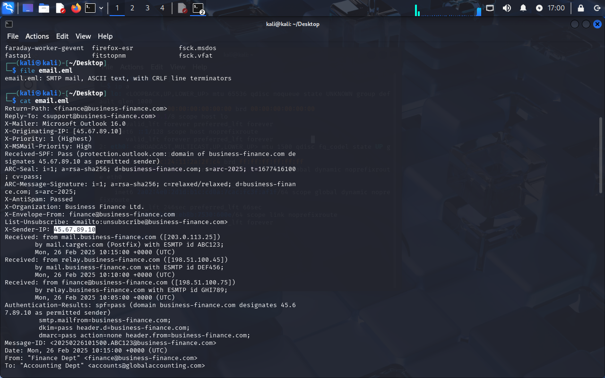
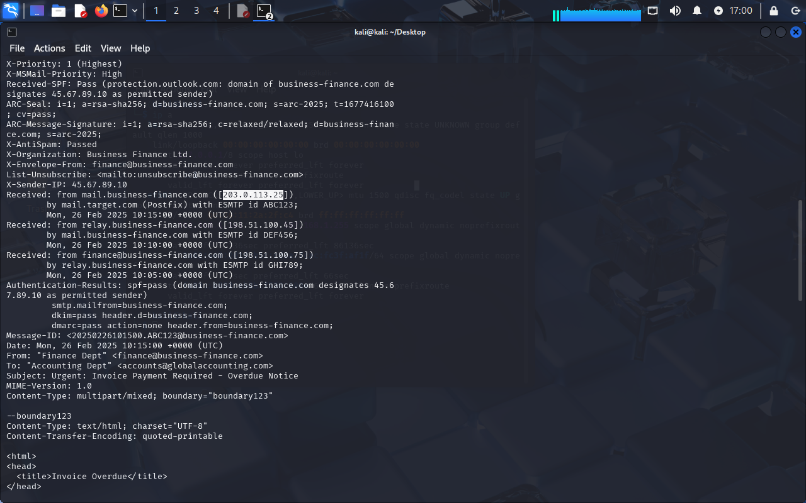
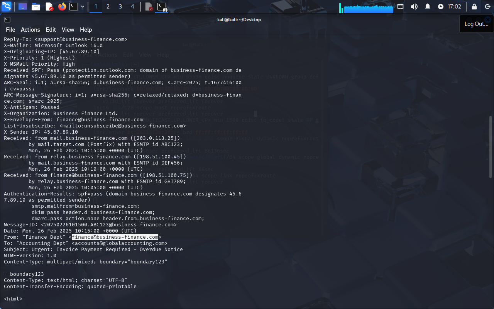
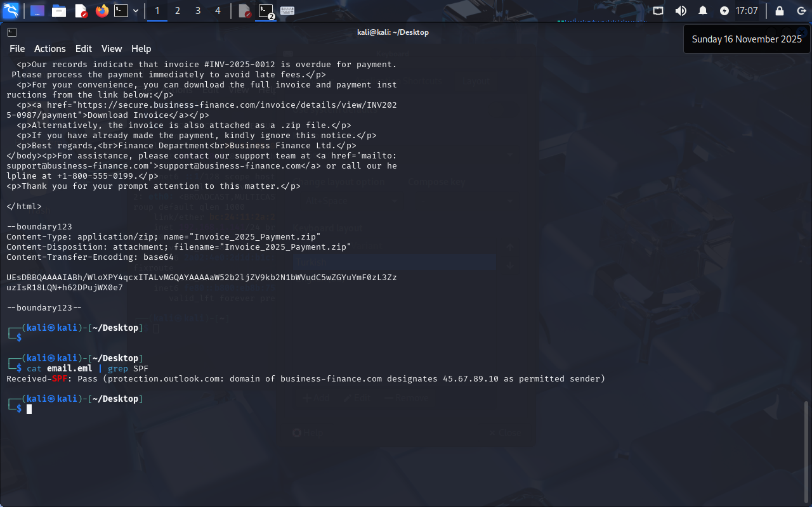
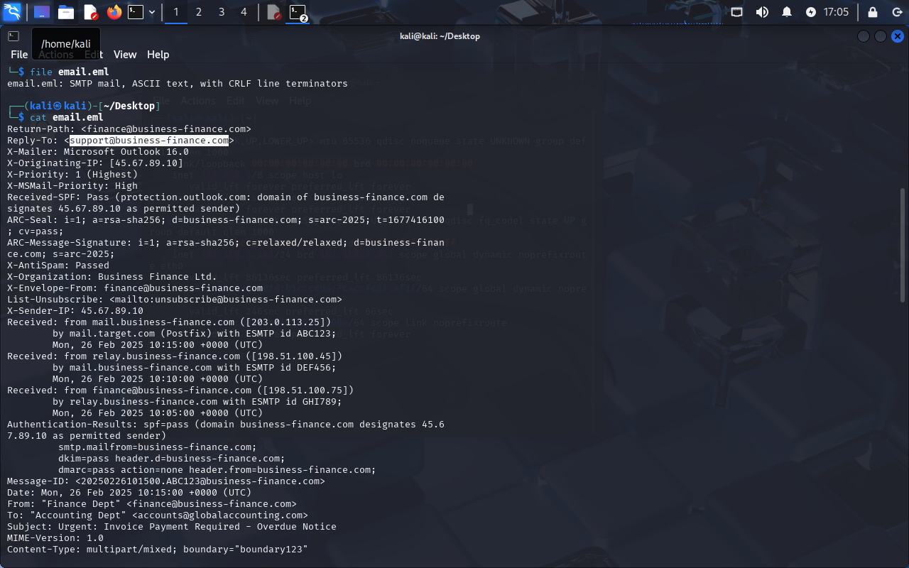
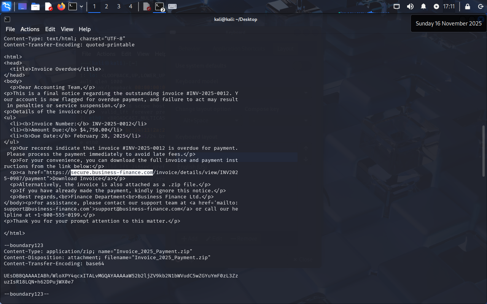
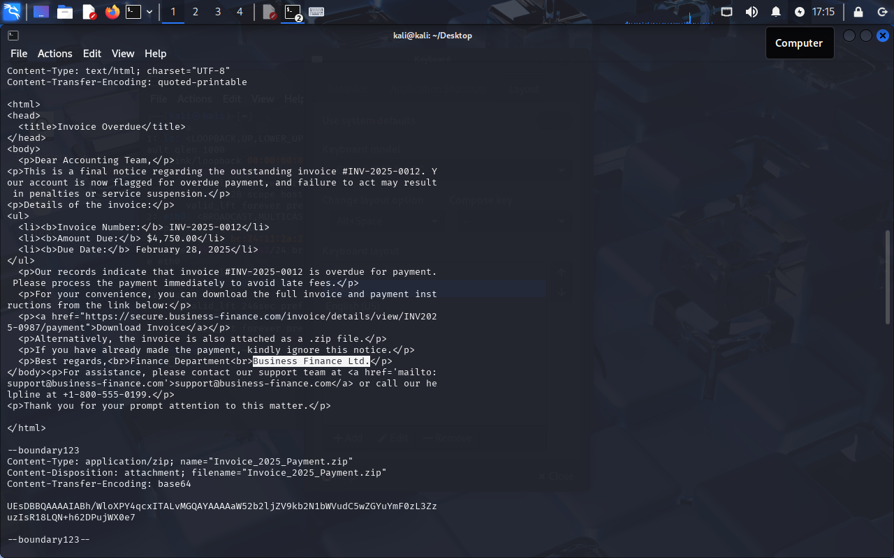
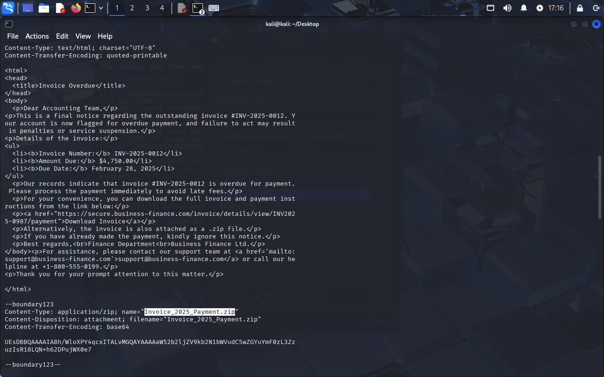
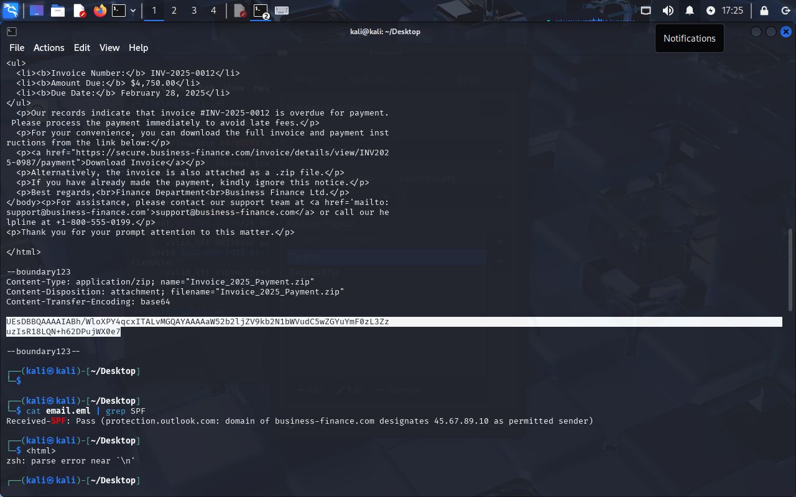

# PhishNet - Sherlock Writeup


**Completed:** 2025-11-16 | **Time:** ~1 Hour

This was a straightforward email forensics challenge involving a suspicious payment request. The goal was to trace the email source and dig into a malicious attachment.

---

## The Investigation

We have a single `email.eml` file. An accounting team got hit with an "urgent invoice" scam. Classic urgency lure.

### 1. Tracking the Source (Headers)

First thing I checked was where this actually came from. Looking at the raw headers:

```bash
cat email.eml | grep -i "X-Sender-IP\|X-Originating-IP"
```

Found `X-Sender-IP: 45.67.89.10`. This is the smoking gun for the origin machine.


*X-Sender-IP field showing the originating address*

Next, tracing the relay chain through `Received` headers:

```bash
cat email.eml | grep "Received:"
```


*Received headers showing the mail path*

The last hop before it hit the victim's server was `203.0.113.25`.

### 2. Sender Spoofing

The `From` header says `"Finance Dept" <finance@business-finance.com>`, but that domain looked shady.


*From: header showing the sender*

Checking SPF to see if this server was authorized:

```bash
grep "Received-SPF" email.eml
```


*SPF result showing "Pass"*

Result: `Pass`. But here's the catch — SPF only validates that the IP is authorized for that domain. It doesn't mean the domain itself is trustworthy. The attacker either registered or compromised the entire domain.

The `Reply-To` was set to a different address:


*Reply-To pointing to a different inbox*

`support@business-finance.com` — if someone hit reply, it would go straight to the attackers.

### 3. The Phishing URL

Inside the email body, there was a link:


*HTML body showing the phishing link*

```html
<a href="https://secure.business-finance.com/invoice/details/view/INV2025-0987/payment">Download Invoice</a>
```

The "secure" subdomain is a classic trick to build false trust.

The email signature revealed the fake company name:


*Signature showing "Business Finance Ltd."*

### 4. The Attachment (Payload)

The email had a base64 encoded ZIP attachment:


*Attachment metadata showing Invoice_2025_Payment.zip*

```
Content-Type: application/zip; name="Invoice_2025_Payment.zip"
```

I decoded it and calculated the hash:


*CyberChef showing the SHA-256 hash*

**SHA-256:** `8379c41239e9af845b2ab6c27a7509ae8804d7d73e455c800a551b22ba25bb4a`

### 5. The Hidden Malware

Using exiftool to peek inside the ZIP:

```bash
exiftool Invoice_2025_Payment.zip
```


*ExifTool revealing the hidden .bat file*

**Filename:** `invoice_document.pdf.bat`

Classic double extension trick. Windows hides known extensions by default, so users see "invoice_document.pdf" and click it. In reality, it's a batch script.

---

## Indicators of Compromise (IOCs)

| Type | Value | Context |
|------|-------|---------|
| **Sender IP** | 45.67.89.10 | Originating IP |
| **Relay IP** | 203.0.113.25 | Last hop relay |
| **Sender Email** | finance@business-finance.com | Spoofed sender |
| **Reply-To** | support@business-finance.com | Attacker's collection inbox |
| **Phishing Domain** | secure.business-finance.com | Malicious URL |
| **Company Name** | Business Finance Ltd. | Fake entity |
| **Attachment** | Invoice_2025_Payment.zip | Malware container |
| **Malware Hash** | 8379c41239e9af845b2ab6c27a7509ae8804d7d73e455c800a551b22ba25bb4a | SHA-256 |
| **Malware File** | invoice_document.pdf.bat | Double extension executable |

## MITRE ATT&CK Mapping

| Technique | Description |
|-----------|-------------|
| **T1566.001** | Phishing: Spearphishing Attachment |
| **T1036.007** | Masquerading: Double File Extension |
| **T1204.002** | User Execution: Malicious File |

---

## Key Takeaways

1. **SPF "Pass" ≠ Safe** — Authentication validates sender authorization, not trustworthiness.
2. **Double extensions are effective** — Most users won't notice `.pdf.bat` with default Windows settings.
3. **Reply-To mismatch is a red flag** — Different From and Reply-To addresses often indicate phishing.
4. **Urgency = manipulation** — "Overdue invoice" language is designed to bypass rational thinking.
